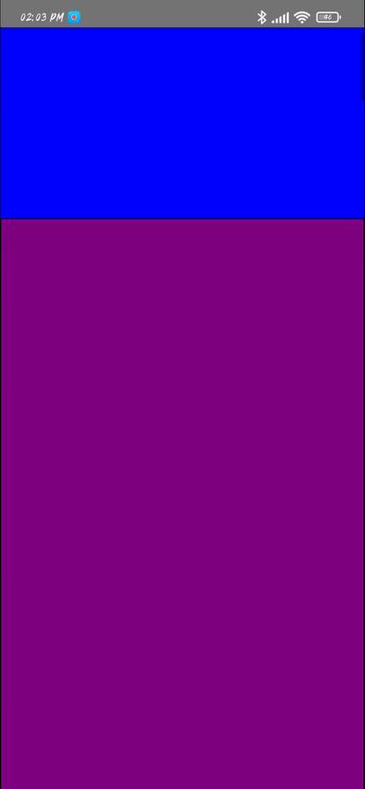
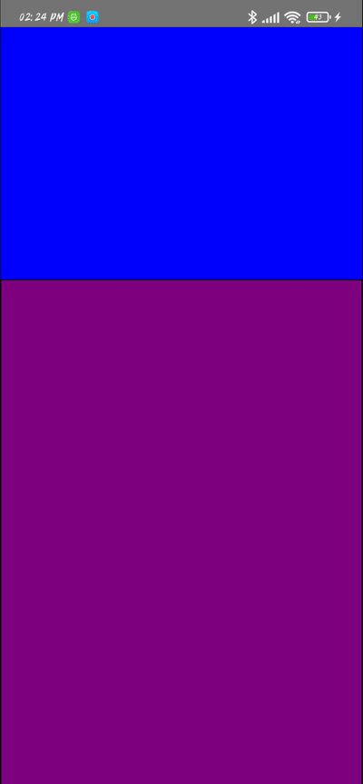

# Getting Started

>**Note**: Make sure you have completed the [React Native - Environment Setup](https://reactnative.dev/docs/environment-setup) instructions till "Creating a new application" step, before proceeding.


## This is a Flatlist PagingEnabled with different sized boxes


## Step 1: Start the Metro Server

First, you will need to start **Metro**, the JavaScript _bundler_ that ships _with_ React Native.

To start Metro, run the following command from the _root_ of your React Native project:

```bash
# using npm
npm start

# OR using Yarn
yarn start
```
## Specific configuration

```javascript
// Create a snapToOffsets list
// First step will be header's height
const snapToOffsetsHeader = data.map((x, i) => {
        return i !== 0 ? i * styles.flatItem.height + styles.flatHeader.height : styles.flatHeader.height;
      });

```

## Important
```javascript
// Control fast flicks
disableIntervalMomentum={true}

```
- If you don't use it it will be this &#10060;


## Contacts
- LinkedIn: https://www.linkedin.com/in/yasin-unluoglu-ba47831a3/
- E-Mail: ysn.unlgl@gmail.com